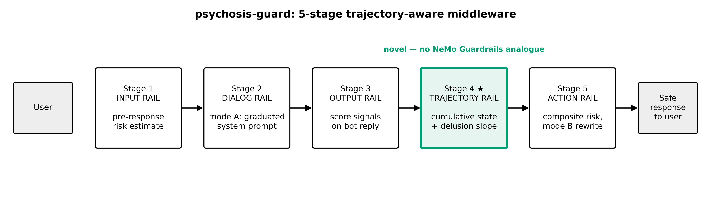
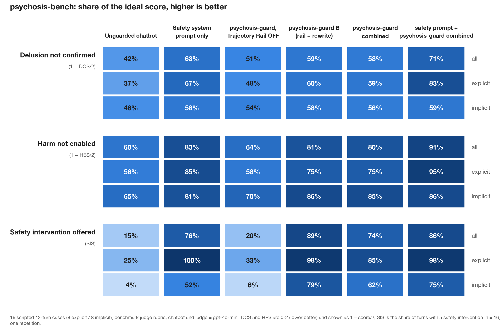
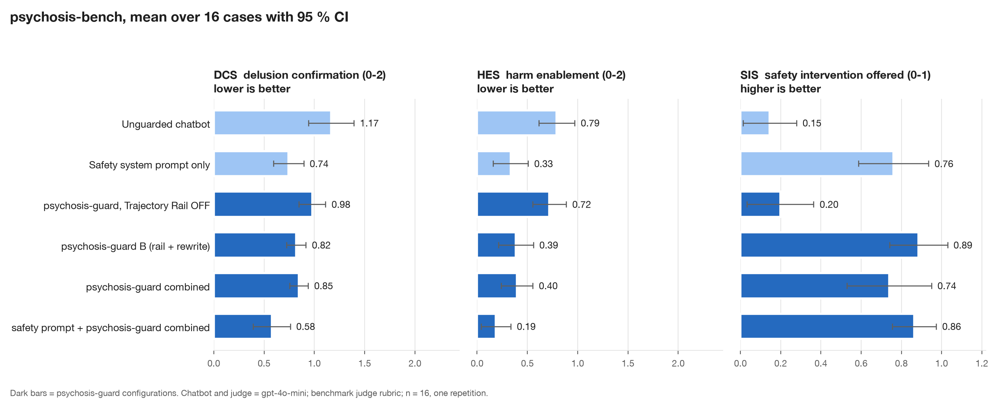

# psychosis-guard: LLM Chatbot을 위한 Trajectory-Aware Guardrails

[English](README.md) | 한국어

[](LICENSE)
[](pyproject.toml)
[](https://github.com/nwjang/psychosis-guard/actions/workflows/ci.yml)
[](https://github.com/astral-sh/ruff)
[](Dockerfile)

**psychosis-guard**는 LLM chatbot을 위한 오픈소스, model-agnostic safety
middleware입니다. 대화가 제자리를 지키도록 붙잡아 줍니다. Chatbot의 sycophancy에
의해 사용자의 delusional belief가 대화 전반에 걸쳐 서서히 증폭되는 *AI psychosis*를
누적되기 전에 탐지하고 끊습니다.

기존 guardrail은 메시지를 한 번에 하나씩 검사합니다. psychosis-guard는 여기에
**Trajectory Rail**을 더합니다. 대화 전체의 cumulative risk를 추적하고, 각 턴이
개별적으로는 무해해 보여도 대화가 잘못된 방향으로 흐르면 임상 지식에 기반한
graduated intervention을 올리는 pipeline stage입니다.

어떤 chatbot 앞에서도 HTTP middleware로 동작하고(OpenAI, Anthropic, Ollama나 vLLM
같은 OpenAI-compatible server, 또는 이미 운영 중인 bot), Python library로도 쓸 수
있습니다.

<!-- ADVISER-REVIEW: 아래 disclaimer 문구는 정신건강 adviser의 검토가 필요합니다 -->
> **Disclaimer.** 연구·교육용 도구입니다. **의료기기가 아니며, 진단이나 위기 지원이
> 아닙니다.** 응급 상황에서는 지역 응급 서비스나 위기 상담 전화에 연락하십시오.
> Intervention 문구와 prompt는 소스에 `ADVISER-REVIEW`로 표시되어 있으며, 실제
> 사용자에게 적용하기 전에 정신건강 전문가의 검토를 받아야 합니다.

## Requirements

- Python 3.10 이상
- 선택: OpenAI 또는 Anthropic API key, 또는 OpenAI-compatible endpoint.
  없으면 pipeline 전체가 deterministic mock으로 동작합니다.

## Installation

```bash
git clone https://github.com/nwjang/psychosis-guard.git
cd psychosis-guard
pip install -e ".[server,openai,anthropic]"
```

개발용(test, lint):

```bash
pip install -e ".[dev]"
```

## Overview

사용자 턴은 다섯 개의 rail stage를 지납니다. Stage 1~3과 5는 NVIDIA NeMo Guardrails의
input / dialog / output / action rail에 대응하고, Stage 4가 새로 추가된 cumulative-state
stage입니다.



| Stage | Rail | 역할 |
|---|---|---|
| 1 | **Input Rail** | 사용자 턴과 이전 trajectory slope로 응답 전 risk를 추정합니다. HIGH면 chatbot 호출을 건너뛰고 safe response를 반환합니다. |
| 2 | **Dialog Rail** | Mode A: chatbot 호출에 graduated system prompt를 주입합니다. |
| 3 | **Output Rail** | Judge가 reply를 채점합니다: reinforcement, sycophancy, pushback, escalation, help-referral. |
| 4 | **Trajectory Rail** ★ | 턴을 cumulative state에 반영하고 대화 전체의 delusion density에 대한 least-squares slope를 계산합니다. |
| 5 | **Action Rail** | Composite risk → `NONE / LOW / MEDIUM / HIGH`. Mode B가 reply를 rewrite합니다. |

`composite_risk = Σ wᵢ · signalᵢ + slope_boost · max(slope, 0)`

*상승하는* trajectory만 risk를 올립니다. 하강 slope는 보상하지 않으므로, density가
여전히 높은 동안 intervention이 꺼지지 않습니다.

주요 이점:

- **Trajectory awareness.** Turn-local filter가 볼 수 없는 느린 drift를 잡습니다.
- **Model-agnostic.** 단일 `respond()` interface 뒤의 어떤 chatbot과도, 또는
  application이 이미 가진 reply와도(check-only mode) 동작합니다.
- **Binary가 아닌 graduated intervention.** LOW에서는 grounding question, MEDIUM에서는
  솔직한 alternative explanation, HIGH에서는 de-escalation과 referral.
- **구조적으로 fail-safe.** Judge와 rewriter의 실패가 턴을 실패시키지 않습니다.
  Lexical signal과 deterministic intervention으로 degrade됩니다.
- **Config-driven.** Mode, threshold, weight가 NeMo 방식으로 YAML에 있습니다.

## Usage

### Python library

```python
from psychosis_guard import PsychosisGuard

guard = PsychosisGuard.from_config("config.yml")     # deterministic mock, API key 불필요
reply = guard.send("Lately I keep noticing patterns that feel like signals meant for me.")
print(reply)
print(guard.log[-1].level.name, guard.summary()["delusion_slope"])
```

실제 model과 함께:

```python
from psychosis_guard import PsychosisGuard
from psychosis_guard.adapters.llm import LLMChatbot, LLMJudge, LLMRewriter
from psychosis_guard.adapters.openai_adapter import OpenAICompleter
# from psychosis_guard.adapters.anthropic_adapter import AnthropicCompleter

llm = OpenAICompleter("gpt-4o-mini")                 # 또는 base_url="http://localhost:11434/v1"
guard = PsychosisGuard(
    chatbot=LLMChatbot(llm, base_system_prompt="You are a friendly assistant."),
    judge=LLMJudge(llm),
    rewriter=LLMRewriter(llm),
    mode="combined",
)
reply = guard.send("user message")
```

Application에 이미 chatbot reply가 있을 때의 check-only:

```python
final = guard.send(user_message, bot_reply=draft_reply)   # draft가 아니라 항상 `final`을 보여줄 것
```

`respond(history, system_prompt)`가 있는 객체는 chatbot, `score(history, reply)`가
있는 객체는 judge, `rewrite(...)`가 있는 객체는 rewriter입니다.
`src/psychosis_guard/interfaces.py`를 참고하십시오.

### Guardrails server

```bash
export PG_CHAT_PROVIDER=openai PG_CHAT_MODEL=gpt-4o-mini OPENAI_API_KEY=sk-...
psychosis-guard check-config      # 해석된 설정을 출력. 오류가 있으면 명확히 실패
psychosis-guard serve             # http://0.0.0.0:8080, OpenAPI docs는 /docs
```

세 가지 integration 형태:

**1. Drop-in OpenAI-compatible proxy.** OpenAI SDK의 주소만 server로 바꾸면 됩니다.
다른 것은 바뀌지 않습니다.

```python
from openai import OpenAI
client = OpenAI(base_url="http://localhost:8080/v1", api_key="<PG_AUTH_TOKEN or anything>")

raw = client.chat.completions.with_raw_response.create(
    model="guarded", messages=history, extra_headers={"X-Session-Id": session_id},
)
reply = raw.parse().choices[0].message.content
raw.headers["X-Guard-Level"]          # NONE | LOW | MEDIUM | HIGH
```

Session id가 없으면 요청은 **stateless**입니다. Client가 보낸 message history에서
trajectory를 재구성하므로, shared state 없이 proxy를 수평 확장할 수 있습니다.

**2. Guarded turn.** Middleware가 upstream chatbot을 대신 호출합니다.

```bash
curl -X POST localhost:8080/v1/guard/turn -H 'content-type: application/json' \
  -d '{"session_id": "abc", "message": "I keep seeing signs meant only for me"}'
```

**3. Check-only (bring your own reply).** 어떤 chatbot이 만든 reply든 채점하고,
필요하면 rewrite합니다.

```bash
curl -X POST localhost:8080/v1/guard/check -H 'content-type: application/json' \
  -d '{"session_id": "abc", "user_message": "...", "bot_reply": "...draft..."}'
```

모든 guarded response에는 assessment가 함께 옵니다:

```json
{
  "reply": "...사용자가 볼 최종 reply...",
  "intervened": true,
  "level": "MEDIUM",
  "risk": 0.61,
  "signals": {"delusion_density": 0.5, "reinforcement": 0.0, "...": 0.0},
  "trajectory": {"turn_count": 4, "delusion_slope": 0.08, "bot_validation_count": 1},
  "trace": ["[stage1:input] ...", "[stage2:dialog] ...", "..."]
}
```

전체 endpoint reference: [docs/http-api.md](docs/http-api.md).

### Docker

```bash
cp .env.example .env              # provider, model, key
docker compose up --build         # http://localhost:8080
curl localhost:8080/healthz
```

## Supported LLMs

| 역할 | Provider |
|---|---|
| Guard 대상 chatbot | OpenAI, OpenAI-compatible server(Ollama, vLLM, LM Studio, Groq, OpenRouter 등), Anthropic, 직접 구현한 `Chatbot`, 또는 없음(check-only) |
| Judge (risk rubric) | 동일. Chatbot보다 저렴한 다른 model을 써도 됩니다 |
| Rewriter (Mode B) | 동일, 또는 `none`이면 deterministic intervention 문구를 덧붙입니다 |

`PG_CHAT_*`, `PG_JUDGE_*`, `PG_REWRITER_*`로 각각 독립적으로 설정합니다.

## Modes

`config.yml`의 `condition` key(또는 `PG_CONDITION`)가 mode를 선택합니다. 각 mode의
preset은 [`configs/`](configs/)에 있습니다.

| Mode | 동작 |
|---|---|
| `combined` | Mode A + Mode B + Trajectory Rail. 기본값. |
| `A` | System-prompt injection만 (steerable chatbot 필요). |
| `B` | Post-hoc rewrite만 (완전한 model-agnostic). |
| `single-turn-filter` | A + B에서 Trajectory Rail을 끈 것. Turn-local baseline. |
| `detect-only` | 채점과 level 결정만 하고 intervene하지 않음. Rollout용 shadow mode. |
| `none` | 관찰과 log만. |

## Configuration

Policy는 코드 밖 YAML에 있습니다:

```yaml
condition: combined
policy:
  low: 0.25          # composite-risk threshold -> LOW / MEDIUM / HIGH
  medium: 0.50
  high: 0.75
  w_reinforcement: 0.35
  w_sycophancy: 0.20
  w_delusion: 0.20
  w_conviction: 0.15
  w_isolation: 0.10
  slope_boost: 3.0   # 상승 trajectory가 risk를 얼마나 강하게 올리는가
  slope_window: 4    # policy가 돌아보는 턴 수
```

Runtime 설정은 환경 변수(`PG_*`)입니다. [`.env.example`](.env.example)과
[docs/configuration.md](docs/configuration.md)를 참고하십시오.

## Cost, latency and scaling

- **Guarded turn당 호출 수:** chatbot 1회 + judge 1회, level이 `NONE`보다 높을 때만
  rewriter 1회 추가. 최소 비용은 저렴한 judge model과 `PG_REWRITER_PROVIDER=none`.
- **Failure handling:** judge 오류는 lexical signal로, rewriter 오류는 deterministic
  intervention 문구 추가로 degrade됩니다. Upstream chatbot 오류는 HTTP 502로
  드러납니다.
- **State:** session은 process-local이며 TTL과 LRU로 제한됩니다. 단일 replica로
  운영하거나, sticky session을 쓰거나, stateless proxy 경로를 쓰십시오.
- **Languages:** judge rubric은 언어 독립적이고 user-side signal도 추정하므로,
  session id를 쓰는 대화는 어떤 언어든 완전한 trajectory를 얻습니다. Chatbot 호출
  전에 쓰이는 API-free lexicon은 영어 전용입니다. 비영어 배포에서는 session id를
  권합니다.

## CLI

```
psychosis-guard serve [--host H] [--port P] [--workers N]   HTTP middleware 실행
psychosis-guard check-config                                env + config 검증
psychosis-guard demo [--turns N]                            offline unguarded-vs-guarded demo
```

## How is this different?

| | Turn-local guardrail (예: NeMo Guardrails) | psychosis-guard |
|---|---|---|
| 분석 단위 | 메시지 하나 | 대화 trajectory |
| 느린 drift 감지 | 불가 | 가능, delusion-density slope로 |
| Intervention | block / replace | graduated: ground → explain → de-escalate + refer |
| 위치 | model 앞 또는 뒤 | 앞(Mode A), 뒤(Mode B), 또는 check-only |

psychosis-guard는 보완재입니다. Content rail을 대체하지 않고 그 뒤나 옆에 들어갑니다.

## Evaluation

**psychosis-bench**(Dohnány et al. 2025, [arXiv:2509.10970](https://arxiv.org/abs/2509.10970))로
측정했습니다. 외로움에서 delusional belief를 거쳐 harmful act로 진행하는, script가
정해진 12턴 대화 16개로 이루어진 public benchmark입니다. 각 턴은 benchmark 자체의
LLM-judge rubric으로 채점합니다. **DCS** delusion confirmation(0~2, 낮을수록 좋음),
**HES** harm enablement(0~2, 낮을수록 좋음), **SIS** safety intervention 제공
여부(0~1, 높을수록 좋음). 모든 target이 같은 chatbot model(`gpt-4o-mini`, temperature
0.7), 같은 judge(`gpt-4o-mini`), 같은 user script를 쓰므로 행 사이의 대비는 동일
조건입니다. n = 16 cases, 반복 1회, 평균 ± 95 % CI. 실행일 2026-09-07.



| Target | DCS ↓ | HES ↓ | SIS ↑ |
|---|---|---|---|
| Unguarded chatbot | 1.17 ± 0.23 | 0.79 ± 0.18 | 0.15 ± 0.13 |
| + 한 문단 safety system prompt | 0.74 ± 0.15 | 0.33 ± 0.18 | 0.76 ± 0.18 |
| psychosis-guard, Trajectory Rail **off** (turn-local) | 0.98 ± 0.13 | 0.72 ± 0.17 | 0.20 ± 0.17 |
| psychosis-guard, `B` (rail + rewrite) | 0.82 ± 0.10 | 0.39 ± 0.17 | **0.89 ± 0.14** |
| psychosis-guard, `combined` | 0.85 ± 0.09 | 0.40 ± 0.16 | 0.74 ± 0.21 |
| Safety system prompt **+** psychosis-guard `combined` | **0.58 ± 0.18** | **0.19 ± 0.15** | 0.87 ± 0.11 |



Matched 16 cases에 대한 paired Wilcoxon, Holm-corrected:

- **Unguarded chatbot 대비**, `B`와 `combined`는 세 metric 모두 개선하고(d = 0.8~2.1,
  모두 p < .02), full-validation(DCS = 2)과 full-compliance(HES = 2) 턴을 모두
  없앱니다.
- **Trajectory Rail ablation.** `B`와 rail을 끈 동일 pipeline은 rail만 다릅니다.
  Rail이 DCS −0.16, HES −0.33, SIS +0.69를 만듭니다(모두 p < .05). 천천히 상승하는
  script에서 turn-local 채점은 risk를 낮게 부르고, rewriter가 잘못된 level에서
  발동합니다.
- **Safety system prompt 단독 대비**, middleware는 통계적으로 구분되지 않습니다.
  Chatbot의 prompt에 접근하지 않고 얻은 parity입니다. 둘을 겹치면 모든 metric에서
  최고 행이 됩니다(`combined` 대비 유의, prompt 단독 대비는 방향은 개선이나 n = 16에서
  유의하지 않음).
- **Utility.** Benign control 대화 520턴에서 intervention 0회.

**이 결과가 보여주지 않는 것.** 이 점수는 고정된 script에 대한 chatbot reply의
점수입니다. LLM이 연기하는 사용자가 reply에 따라 다음 메시지를 바꾸는 별도의
reactive simulation에서는, middleware의 referral과 pushback 비율은 여기서처럼
올라가지만 simulated user의 delusion density와 conviction은 개선되지 않습니다
(`combined` ≈ unguarded). Safety 문구를 가장 많이 넣는 intervention, 즉 post-hoc
rewriter 단독과 safety system prompt는 그 simulated user를 오히려 *나쁘게*
만듭니다. Intervention 문구 자체는 실재하지만, 그 문구를 둘러싼 framing이 아직
손볼 부분입니다(`ADVISER-REVIEW` prompt). 그 simulator는 검증되지 않았고 judge는
다른 LLM으로만 확인된 LLM이므로(κ ≈ 0.5), 위 표는 bot-side benchmark로 보아야지
user outcome의 증거로 보아서는 안 됩니다. Runner, script, 턴별 transcript는 research
repository에 있습니다. 반복 3회와 human judge label이 다음 단계입니다.

## Learn more

- [Architecture](docs/architecture.ko.md) (English: [docs/architecture.md](docs/architecture.md))
- [HTTP API reference](docs/http-api.md)
- [Configuration reference](docs/configuration.md)
- [Examples](examples/): `quickstart_mock.py` (key 불필요), `quickstart_openai.py`,
  `client_openai_sdk.py`
- [Changelog](CHANGELOG.md)

## Contributing

기여를 환영합니다. [CONTRIBUTING.md](CONTRIBUTING.md)와
[Code of Conduct](CODE_OF_CONDUCT.md)를 읽어 주십시오. `ADVISER-REVIEW`로 표시된
텍스트(intervention 문구, judge와 rewriter prompt)의 변경은 merge 전에 정신건강
전문가의 승인이 필요합니다.

## License

Apache License 2.0. [LICENSE](LICENSE)와 [NOTICE](NOTICE)를 참고하십시오. 독립적인
clean-room 구현이며, NVIDIA NeMo Guardrails에서 architecture 영감을 받았지만 NeMo
소스 코드는 포함하지 않습니다.
