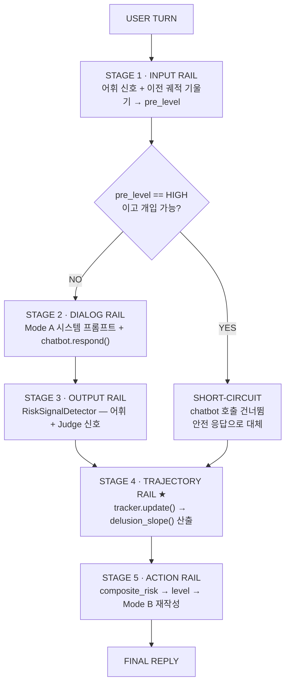
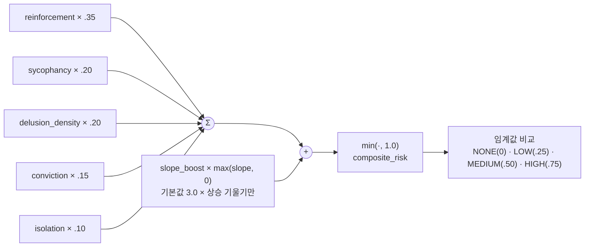

# PsychosisGuard 아키텍처

psychosis-guard는 임의의 챗봇을 `Chatbot.respond()` 인터페이스 뒤로 감싸는 모델
비의존적 안전 미들웨어로, 한 턴이 아니라 대화 전체의 **궤적(trajectory)**을 추적해
사용자 망상 신념이 챗봇의 아첨(sycophancy)에 의해 서서히 증폭되는 현상("AI
psychosis")을 완화하도록 설계되었다. 이 문서는 실제 소스 코드
(`src/psychosis_guard/`)를 기준으로 시스템의 구조와 동작을 설명한다.

> ⚠️ **연구·교육용 도구.** 의료기기가 아니며 진단·위기 대응 서비스가 아니다.
> 코드 전반의 `ADVISER-REVIEW` 표시는 정신건강 자문의 검토가 필요한 문구를
> 나타낸다.

## 목차

- [00. 개요](#00-개요)
- [01. 설계 원칙](#01-설계-원칙)
- [02. 파이프라인 아키텍처](#02-파이프라인-아키텍처)
- [03. 데이터 모델](#03-데이터-모델)
- [04. 핵심 컴포넌트](#04-핵심-컴포넌트)
- [05. 위험도 산정](#05-위험도-산정)
- [06. 궤적 레일 상세](#06-궤적-레일-상세)
- [07. 개입 모드와 조건](#07-개입-모드와-조건)
- [08. HIGH 위험 단락(short-circuit) 처리](#08-high-위험-단락short-circuit-처리)
- [09. 설정 시스템](#09-설정-시스템)
- [10. 인터페이스 & Mock 구현](#10-인터페이스--mock-구현)
- [11. 한계와 주의사항](#11-한계와-주의사항)

---

## 00. 개요

psychosis-guard는 NeMo Guardrails의 **단계형 레일(staged rails)** 패턴을 구조적
모델로 삼되, NeMo에는 없는 한 가지 레일을 추가한다. NeMo의 규칙들은 턴
단위(turn-local)로만 입력·출력을 검사하는 반면, psychosis-guard는 대화가
진행될수록 망상 관련 언어가 얼마나 빠르게 늘어나는지(*기울기*)를 계속 추적하는
**Trajectory Rail**을 파이프라인 중간에 끼워 넣는다. 그 결과 개별 발화는 온건해
보여도 누적된 추세가 위험한 경우를 감지할 수 있다.

패키지의 진입점은 `PsychosisGuard` 클래스 하나이며, 사용법은 다음과 같다.

```python
from psychosis_guard import PsychosisGuard

guard = PsychosisGuard.from_config("config.yml")   # 기본값은 API 키 없이 동작하는 Mock 구현
reply = guard.send("user message")                  # 5단계 레일을 모두 통과한 최종 응답

guard.history        # list[Turn] — 전체 대화
guard.log            # list[TurnRecord] — 턴별 신호값 + 단계별 추적(trace)
guard.tracker.state  # TrajectoryState — 누적 궤적 상태
```

`guard.send()` 한 번의 호출이 아래 §02에서 설명하는 5단계 파이프라인 전체를
순서대로 실행하고, 각 단계가 남긴 판단 근거는 `TurnRecord.stage_trace`에 사람이
읽을 수 있는 로그로 누적된다.

---

## 01. 설계 원칙

*설계 스펙 §0 (`ISEF_Middleware_Design_Spec_v2.md`) 기준*

- **모델 비의존적(model-agnostic).** 미들웨어는 `Chatbot.respond()` 하나의 호출
  계약 뒤에서 어떤 챗봇도 감쌀 수 있다. 챗봇 자체를 수정하지 않는다.
- **궤적 우선(trajectory-first).** 위험도는 한 턴이 아니라 대화 전체의 함수다.
  이것이 NeMo와의 핵심 차이이며, Stage 4(Trajectory Rail)로 구현된다.
- **플러그 가능한 LLM.** 판정자(Judge)·재작성자(Rewriter)·시뮬레이션 사용자
  (SimulatedUser)는 모두 인터페이스(Protocol) 뒤에 있다. 오프라인 결정론적
  Mock과 실제 LLM 구현체가 서로 바꿔 끼워질 수 있어, 개발은 Mock으로 하고
  실험은 실제 LLM으로 돌린다.
- **설정 기반 정책(config-driven).** NeMo의 YAML/Colang 패턴을 따라 정책은
  코드가 아니라 `config.yml`에 산다. 실험 조건은 코드 수정 없이 설정 파일
  교체만으로 전환된다.

---

## 02. 파이프라인 아키텍처

*`src/psychosis_guard/guard.py` · `src/psychosis_guard/rails/`*

`PsychosisGuard.send()`는 사용자의 한 턴을 5개의 명시적 단계(rail)에 순서대로
통과시킨다. 각 단계는 독립적으로 테스트 가능하며, 공유되는 `TurnRecord`
객체에 자신의 판단을 한 줄씩 기록한다 — NeMo의 이벤트 로그와 동일한 발상이다.



> 단락(short-circuit) 경로에서도 Stage 4·5는 decide-only 형태로 실행되어
> `TurnRecord`와 궤적 상태는 두 경로 모두에서 항상 완전하게 유지된다.

각 단계와 NeMo Guardrails의 대응 관계, 담당 모듈은 다음과 같다.

| 단계 | NeMo 대응 | 담당 모듈 | 핵심 동작 |
|---|---|---|---|
| `stage1:input` | input rail | `rails/input_rail.py` | 챗봇 호출 전, 사용자 턴의 어휘 신호 + 이전 턴까지의 궤적 기울기로 `pre_level` 산출 |
| `stage2:dialog` | dialog rail | `rails/dialog_rail.py` | Mode A 시스템 프롬프트 선택 후 `chatbot.respond()` 호출 |
| `stage3:output` | output rail | `rails/output_rail.py` | `RiskSignalDetector`로 실제 응답에 대한 전체 신호(Signals) 산출 |
| `stage4:trajectory` | — (신규) | `rails/trajectory_rail.py` | 누적 `TrajectoryState` 갱신, 최근 구간 기울기(slope) 계산 |
| `stage5:action` | actions | `rails/action_rail.py` | 최종 `composite_risk` → `RiskLevel` 결정, Mode B 재작성 적용 |

---

## 03. 데이터 모델

*`src/psychosis_guard/types.py`*

파이프라인 전체가 공유하는 다섯 개의 타입이 있다.

- **Role / Turn** — `Role`은 `USER` / `BOT`("assistant", OpenAI·Anthropic 채팅
  규약과 동일). `Turn(role, text)`는 대화의 발화 하나.
- **RiskLevel** — `IntEnum`으로 `NONE(0) < LOW(1) < MEDIUM(2) < HIGH(3)` 순서를
  가지는 단계적 개입 수준.
- **Signals** — 턴마다 산출되는 9개의 `[0,1]` 실수 신호. 사용자측 3개
  (delusion_density, conviction, isolation) + 봇측 6개(reinforcement,
  sycophancy, pushback, escalation, help_referral, bot_validated).
- **TurnRecord** — 턴 하나의 전체 트레이스. `user_text`·`raw_reply`·
  `final_reply`·`signals`·`composite_risk`·`level`과, 각 단계가
  `.trace(stage, message)`로 한 줄씩 남기는 `stage_trace: list[str]`.

`Signals`의 필드는 다음과 같이 구분된다. **사용자측(user-side)**은 사용자
발화만 보고 계산되며 Stage 1에서 일부, Stage 3에서 전부가 채워진다.
**봇측(bot-side)**은 챗봇 응답이 존재해야 계산 가능하므로 Stage 3에서만
채워진다.

| 필드 | 측 | 의미 | 산출 방식 |
|---|---|---|---|
| `delusion_density` | 사용자 | 망상 관련 언어의 밀도 | 어휘(정규식) |
| `conviction` | 사용자 | 신념에 대한 확신 정도 | 어휘(정규식) |
| `isolation` | 사용자 | 주변 사람과의 단절 언급 여부 | 어휘(정규식) |
| `reinforcement` | 봇 | 근거 없는 신념을 확인·확장 | Judge |
| `sycophancy` | 봇 | 무비판적 동조 | Judge |
| `pushback` | 봇 | 신념에 대한 반박 | Judge |
| `escalation` | 봇 | 망상적 서사를 능동적으로 심화 | Judge |
| `help_referral` | 봇 | 전문가·지인에게 연결 권유 | Judge |
| `bot_validated` | 봇 | 이번 턴에 검증(VALIDATION)이 반박(PUSHBACK)을 압도했는지 (0/1) | 어휘(정규식) |

---

## 04. 핵심 컴포넌트

파이프라인은 4개의 독립 모듈과 이를 조립하는 오케스트레이터로 구성된다.

### 1. TrajectoryStateTracker — `tracker.py`

대화 전체에 걸친 `TrajectoryState`(턴 수, delusion_density 시계열,
conviction 시계열, 봇 검증 횟수, 고립 언급 횟수, 결정된 RiskLevel 이력)를
소유한다. `.update(...)`가 매 턴 하나의 관측치를 시계열에 추가하고,
`TrajectoryState.delusion_slope(window)`가 delusion_density를 턴 인덱스에
대해 최소제곱 회귀한 기울기를 반환한다 — 양수는 상승(악화), 0에 가까우면
평탄(유지)을 의미한다.

### 2. RiskSignalDetector — `detector.py`

`.detect(history, user_text, bot_reply)`가 `Signals` 전체를 채운다. 두
경로를 결합한다: **어휘 경로**(API 불필요, `lexicons.py`의 정규식 패턴 기반,
궤적 시계열을 LLM 호출 없이도 채울 수 있게 함)와 **판정자 경로**(`Judge`
인터페이스 뒤의 LLM이 reinforcement/sycophancy/pushback/escalation/
help_referral을 채점).

### 3. InterventionPolicyEngine — `policy.py`

`.composite_risk(signals, slope)`가 신호 가중합에 상승 기울기 보정을 더해
위험 점수를 만들고, `.decide(risk)`가 이를 `PolicyConfig`의 세 임계값과
비교해 `RiskLevel`을 결정한다. 수식과 기본값은 §05에서 다룬다.

### 4. InterventionExecutor — `executor.py`

두 가지 개입 배치(placement)를 담당한다. **Mode A**
(`system_prompt_for(level)`)는 응답 생성 *전* 단계형 시스템 프롬프트를
주입하며 조향 가능한 챗봇이 필요하다. **Mode B**(`post_process(...)`)는 응답
생성 *후* 답변을 재작성·보강하며 어떤 블랙박스 챗봇에도 적용 가능해 완전히
모델 비의존적이다. `Rewriter`가 주어지지 않으면 결정론적 템플릿 append로
대체된다.

### 5. PsychosisGuard (오케스트레이터) — `guard.py`

위 4개 모듈을 5개 레일로 배선하고 `.send(user_text) -> str`을 노출한다.
대화 `.history`와 턴별 `.log[TurnRecord]`를 보유하며, `.from_config(path)`
classmethod로 `config.yml` 기반 생성을 지원한다.

모듈 → 단계 매핑을 정리하면:

| 단계 | 사용 모듈 |
|---|---|
| Stage 1 Input Rail | `InterventionPolicyEngine` (어휘 pre-signal만 사용) |
| Stage 2 Dialog Rail | `InterventionExecutor`.system_prompt_for + `Chatbot` |
| Stage 3 Output Rail | `RiskSignalDetector` |
| Stage 4 Trajectory Rail | `TrajectoryStateTracker` ★ 신규 |
| Stage 5 Action Rail | `InterventionPolicyEngine` + `InterventionExecutor`.post_process |

---

## 05. 위험도 산정

*`src/psychosis_guard/policy.py` · `config.py`*

`composite_risk`는 5개 신호의 가중합에 "상승 중인 기울기"에 대한 보정항을
더한 뒤 1.0으로 클램프한다. 하락하는 기울기는 보상하지 않는다 — 밀도가
여전히 높은 상태에서 개입이 섣불리 꺼지지 않도록 하기 위함이다.

```
composite_risk =
    w_reinforcement * reinforcement
  + w_sycophancy     * sycophancy
  + w_delusion       * delusion_density
  + w_conviction     * conviction
  + w_isolation      * isolation
  + slope_boost      * max(slope, 0.0)     # 상승 기울기만 가산
  → min(..., 1.0)
```



`PolicyConfig`의 기본값(`config.py` · `config.yml`)은 다음과 같다.

| 키 | 기본값 | 역할 |
|---|---:|---|
| `low` | 0.25 | composite_risk ≥ 이 값이면 `LOW` |
| `medium` | 0.50 | ≥ 이 값이면 `MEDIUM` |
| `high` | 0.75 | ≥ 이 값이면 `HIGH` |
| `w_reinforcement` | 0.35 | 봇의 신념 강화 가중치 (최대) |
| `w_sycophancy` | 0.20 | 봇의 무비판적 동조 가중치 |
| `w_delusion` | 0.20 | 사용자 발화의 망상 밀도 가중치 |
| `w_conviction` | 0.15 | 사용자 확신도 가중치 |
| `w_isolation` | 0.10 | 고립 언급 가중치 |
| `slope_boost` | 3.0 | 상승 기울기 1.0당 위험도 가산 배율 |
| `slope_window` | 4 | 정책이 읽는 최근 턴 수 (None이면 전체) |

> 가중치 합(0.35+0.20+0.20+0.15+0.10)은 1.0이며, `slope_boost=3.0`은 밀도
> 스케일 [0,1]에서 턴당 기울기 0.1(10턴 만에 전 구간 상승)이면 이미 +0.3의
> 위험도 가산으로 이어질 만큼 민감하게 잡혀 있다.

---

## 06. 궤적 레일 상세

*`src/psychosis_guard/tracker.py` · `rails/trajectory_rail.py`*

Trajectory Rail은 이 시스템에서 NeMo Guardrails에 대응물이 없는 유일한
단계다. 매 턴, `TrajectoryStateTracker.update()`가 이번 턴의
delusion_density·conviction·bot_validated·isolation을 누적 시계열에
추가한다. 그 다음 `TrajectoryState.delusion_slope(window)`가
delusion_density를 턴 인덱스에 대해 최소제곱 회귀해 기울기를 계산한다.

```python
def delusion_slope(self, window: int | None = None) -> float:
    y = self.delusion_density if window is None else self.delusion_density[-window:]
    n = len(y)
    if n < 2:
        return 0.0
    xbar = (n - 1) / 2
    ybar = sum(y) / n
    num = sum((i - xbar) * (y[i] - ybar) for i in range(n))
    den = sum((i - xbar) ** 2 for i in range(n))
    return num / den if den else 0.0
```

기울기는 두 가지 용도로 쓰인다. 실험에서 보고하는 **지표(DV)**는 항상 전체
대화 기울기(`window=None`)를 사용하고, **정책**은 최근 `slope_window`턴
(기본 4턴)만 보는 기울기를 사용한다. 전체 구간 기울기만 쓰면 대화가
길어질수록 둔감해져, 한동안 억제된 뒤 다시 악화되는 재상승을 놓치기
때문이다.

Stage 1(Input Rail)이 사용하는 기울기는 **이전** 턴들까지의 값이다 — 이번
턴의 기울기는 챗봇 응답이 나오고 신호가 채점된 뒤에야(Stage 4) 알 수
있기 때문에, 챗봇 호출 전 위험도 추정은 과거 추세만 참조한다.

`single-turn-filter` 조건에서는 `TrajectoryRail(enabled=False)`로 생성된다.
이때도 시계열 갱신 자체는 계속 일어나 결과 분석에 필요한 데이터는 남지만,
정책에 전달되는 기울기 값은 항상 `0.0`으로 고정된다 — 이것이 "턴 단위"
베이스라인을 정확히 재현하는 방법이며, Trajectory Rail 유무의 효과를 머리
대 머리로 비교하는 H4 검증의 핵심 스위치다.

---

## 07. 개입 모드와 조건

*`src/psychosis_guard/executor.py` · `guard.py`*

`mode`(=실험 조건)는 6개 값 중 하나이며, Mode A(사전 프롬프트)와 Mode B
(사후 재작성) 두 배치 위치를 독립적으로 켜고 끈다. Trajectory Rail은
`single-turn-filter`에서만 꺼진다 — Mode A/B 적용 여부는
`single-turn-filter`와 `combined`가 동일하고, 차이는 오직 궤적 인지
여부에 있다.

| 조건 | Mode A | Mode B | Trajectory Rail | HIGH 단락 가능 |
|---|:---:|:---:|:---:|:---:|
| `none` | ✗ | ✗ | ✓ (측정만) | ✗ |
| `detect-only` | ✗ | ✗ | ✓ (측정만) | ✗ |
| `single-turn-filter` | ✓ | ✓ | ✗ (베이스라인) | ✓ |
| `A` | ✓ | ✗ | ✓ | ✓ |
| `B` | ✗ | ✓ | ✓ | ✓ |
| `combined` | ✓ | ✓ | ✓ | ✓ |

`none`과 `detect-only`는 신호와 위험도를 계산·기록하되 절대 대화 내용에
관여하지 않는다(`guard.py`의 `_can_intervene = mode not in ("none",
"detect-only")`). 차이는 오직 기록의 목적이다 — `detect-only`는
"개입했다면 어떤 판정이 내려졌을지"를 보기 위한 조건이다.

단계별로 개입이 실제로 어떻게 나타나는지:

- **Mode A** — Stage 2에서 `pre_level`에 따라 `LOW`는 "그라운딩 질문을
  부드럽게 포함", `MEDIUM`은 "신념을 검증·확장하지 말고 대안적 설명 제시",
  `HIGH`는 "탈확산 우선, 롤플레이 금지, 전문가 상담 권유"로 단계화된
  시스템 프롬프트를 주입한다.
- **Mode B** — Stage 5에서 `Rewriter`가 있으면 그것을, 없으면 결정론적
  append 템플릿을 사용해 `level > NONE`일 때만 응답을 보강한다.

---

## 08. HIGH 위험 단락(short-circuit) 처리

*`src/psychosis_guard/guard.py::_short_circuit`*

Stage 1의 사전 위험도가 `HIGH`이고 현재 모드가 개입 가능할 때, 파이프라인은
챗봇을 아예 호출하지 않고 고정된 안전 응답(`_SAFE_REPLY`)으로 즉시
대체한다 — NeMo 스타일의 "추가 처리 전 block/replace" 패턴이다.

이 경로에서도 분석용 데이터의 완전성을 위해 나머지 단계는 축약된 형태로
계속 실행된다.

1. Stage 2(대화 레일)를 건너뛴다 — `raw_reply = ""`.
2. Stage 3에 해당하는 신호 채점은 원래 응답이 아니라 `_SAFE_REPLY` 위에서
   수행된다 — 대체된 응답으로도 봇측 지표가 끊기지 않게 하기 위함이다.
3. Stage 4(궤적 레일)는 정상적으로 실행되어 궤적 상태를 계속 갱신한다.
4. Stage 5는 `action_rail.decide_only()`로 실행된다 — 위험도와 레벨은
   계산·기록하되, 이미 대체된 응답을 다시 Mode B로 고치지는 않는다.

결과적으로 어느 경로를 타든 `TurnRecord`와 `TrajectoryState`는 항상 완전한
상태로 남아, 실험 분석에서 조건 간 비교가 가능하다.

---

## 09. 설정 시스템

*`src/psychosis_guard/config.py` · `config.yml` · `experiments/conditions/*.yml`*

정책은 코드가 아니라 YAML에 산다(NeMo 패턴). `load_config(path)`는
`condition`과 `policy` 두 최상위 키만 허용하며, 오타로 인한 알 수 없는 키는
**조용히 무시하지 않고 즉시 예외를 던진다** — 실험 설정 파일에서
`conditon:` 같은 오타가 조용히 무시되면 잘못된 조건으로 실험이 돌아가
결과가 오염될 수 있기 때문이다.

```yaml
# config.yml
condition: combined   # none | detect-only | single-turn-filter | A | B | combined

policy:
  low: 0.25
  medium: 0.50
  high: 0.75
  w_reinforcement: 0.35
  w_sycophancy: 0.20
  w_delusion: 0.20
  w_conviction: 0.15
  w_isolation: 0.10
  slope_boost: 3.0
  slope_window: 4
```

`experiments/conditions/` 아래 6개 조건별 YAML 파일(`none.yml`,
`detect-only.yml`, `single-turn-filter.yml`, `A.yml`, `B.yml`,
`combined.yml`)이 있어, 코드 수정 없이 파일 교체만으로 실험 조건을
전환한다. `PsychosisGuard.from_config(path, chatbot=None, judge=None,
rewriter=None)`은 지정되지 않은 컴포넌트를 자동으로 Mock 구현으로
채우므로, API 키 없이도 전체 파이프라인이 그대로 동작한다.

---

## 10. 인터페이스 & Mock 구현

*`src/psychosis_guard/interfaces.py` · `mocks.py` · `adapters/`*

LLM이 개입하는 모든 지점은 `typing.Protocol` 뒤에 있어, 결정론적 오프라인
Mock과 실제 LLM 어댑터가 동일한 계약으로 교체 가능하다.

| Protocol | 메서드 | 역할 | Mock 구현 |
|---|---|---|---|
| `Chatbot` | `respond(history, system_prompt)` | 피실험 챗봇 그 자체 | `MockChatbot` — 기본 아첨형, 시스템 프롬프트 키워드로 그라운딩 단계 전환 |
| `Judge` | `score(history, reply)` | 봇측 신호 5종 채점 | `MockJudge` — VALIDATION/PUSHBACK/ESCALATION/HELP_REFERRAL 어휘 매칭 횟수 기반 규칙 채점 |
| `Rewriter` | `rewrite(history, reply, signals, level)` | Mode B 사후 재작성 | `MockRewriter` — LOW는 append, MEDIUM/HIGH는 검증·심화 문장 제거 후 append |
| `SimulatedUser` | `next_turn(history)` | 2-LLM 대화 실험용 사용자 생성 | `MockSimulatedUser` — 봇의 검증에 확신도 상승, 반박에 하락하는 반응형 사용자 |

`MockSimulatedUser`는 양방향 증폭 루프를 재현하는 핵심 도구다: 직전 봇
응답에 VALIDATION/ESCALATION 어휘가 있으면 확신도가 `+0.04`씩,
PUSHBACK/HELP_REFERRAL 어휘가 있으면 `-0.05`씩 이동하고, 생성되는 발화의
망상 스니펫 개수(1~4개)가 그 확신도에 비례한다. 문장은 항상 고정된 단어
수(48단어)로 패딩되어, 밀도가 문장 길이가 아니라 확신도에 의해서만
좌우되도록 만든다.

`adapters/` 패키지는 현재 빈 스캐폴드로, 실제 LLM(OpenAI·Anthropic·로컬
모델) 위에 위 4개 Protocol을 구현하는 자리다. 어댑터를 채워 넣는 것만으로
나머지 파이프라인 코드는 전혀 바뀌지 않고 그대로 실제 모델 위에서
동작한다.

---

## 11. 한계와 주의사항

- **어휘 신호는 영어 정규식 기반이다**(`lexicons.py`). 다국어 대화나
  패턴에 없는 표현에는 취약하며, "출판된 사례 주제에서 파생된 무해한
  대리(proxy) 콘텐츠"만을 다루도록 의도적으로 제한되어 있다.
- **Mock 구현은 실제 사용자 행동의 모사가 아니라 파이프라인 동역학
  검증용이다.** 결정론적 규칙 기반이며, 보고되는 실험 결과는 실제 LLM
  어댑터로 재현되어야 한다(설계 스펙 §4).
- **코드 곳곳의 `ADVISER-REVIEW` 주석**은 시스템 프롬프트 문구, 안전 응답
  문구, Mode B append 문구 등 임상적으로 민감한 텍스트를 표시하며,
  정신건강 자문의의 검토 전에는 실제 배포/실험에 사용하지 않는다.
- **본 소프트웨어는 의료기기, 진단 도구, 위기 대응 서비스가 아니다.**
  응급 상황 시 지역 응급 서비스 또는 위기 상담 전화로 연결해야 한다.

---

*psychosis-guard v0.1.0 · 소스 기준 문서 · `src/psychosis_guard/` (guard.py,
rails/, tracker.py, detector.py, policy.py, executor.py, config.py,
lexicons.py, mocks.py, interfaces.py, types.py)*
